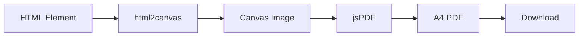
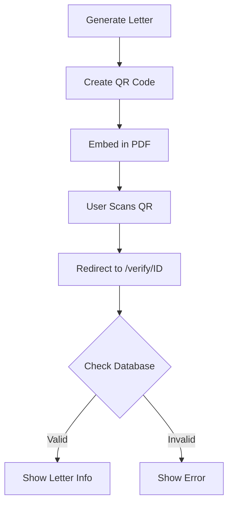

# Professional Letter Creation System

## Overview

A comprehensive A4-formatted letter creation module for PFK AGMK's Letter Management System with PDF generation, QR code verification, and interactive design capabilities.

## 🎯 Key Features

### 1. **A4 Letter Format (210mm × 297mm)**
- Strict adherence to A4 dimensions
- Professional margins (25mm top/bottom, 20mm left/right)
- Print-ready output with proper page breaks
- Multi-page support with automatic pagination

### 2. **Interactive Letter Builder**
- **Real-time Preview**: Side-by-side editing and preview
- **Logo Upload**: Organization logo placement in header
- **Watermark Support**: Optional background watermark
- **Customizable Header**: Organization name, address, contact info
- **Dynamic Content**: Auto-adjusting content area

### 3. **PDF Generation**
- High-quality PDF export using jsPDF + html2canvas
- Preserves formatting and styling
- A4 page size enforcement
- Multi-page documents with consistent headers/footers
- Download-ready files with custom naming

### 4. **QR Code Integration**
- Automatic QR code generation for each letter
- Embedded verification link
- Positioned between organization name and signee
- High error correction level (H)
- Scannable verification system

### 5. **Professional Letter Components**

#### Header Section
```
┌─────────────────────────────────────────┐
│  [LOGO]              ORGANIZATION NAME  │
│                      Address            │
│                      Phone | Email      │
└─────────────────────────────────────────┘
```

#### Letter Meta
```
№ LMS-YYYYMM-XXXX          3 Noyabr 2025 yil
```

#### Recipient Block
```
Recipient Name
Organization Name
Address
```

#### Subject (Centered, Bold, Uppercase)
```
         LETTER SUBJECT
```

#### Body (Justified, 1.6 line height)
```
    First paragraph with indentation...
Second paragraph...
Third paragraph...
```

#### Signature Section
```
                        Organization Name
                             [QR CODE]
                          Signee Name
                          Signee Title
```

#### Footer
```
Organization Name              Page 1 / 2
```

## 📦 Components Architecture

### Core Files

#### 1. `LetterPreview.tsx`
Pure presentation component for A4 letter display:
- **Props**: All letter data fields
- **Styling**: Inline JSX styles for PDF compatibility
- **Responsive**: Adapts to screen but maintains A4 ratio
- **Print-ready**: Includes @media print rules

```typescript
<LetterPreview
  reference="LMS-202511-0001"
  date={new Date()}
  subject="Letter Subject"
  recipientName="John Doe"
  body="Letter content..."
  signeeName="Director Name"
  signeeTitle="Director Title"
  organizationName="PFK AGMK MChJ"
  qrCodeData="https://agmk.uz/verify/LMS-202511-0001"
/>
```

#### 2. `LetterBuilder.tsx`
Interactive editor with live preview:
- **Two-panel Layout**: Editor (left) + Preview (right)
- **File Uploads**: Logo and watermark with base64 encoding
- **Real-time Updates**: Changes reflect immediately
- **Actions**: Save draft, Generate PDF, Close
- **Responsive**: Stacks panels on mobile

Features:
- Organization settings panel
- Letter content editor
- File upload with preview confirmation
- PDF generation button
- Draft saving functionality

#### 3. `letterPDF.ts`
PDF generation utilities:
- `generateLetterPDF()`: Convert HTML element to PDF
- `generateQRCode()`: Create QR code data URL
- `createLetterReference()`: Build verification URL
- `formatLetterDate()`: Format dates in Uzbek

#### 4. `verify/[id]/page.tsx`
QR code verification page:
- Displays letter authenticity
- Shows letter metadata
- Security badge
- Verification timestamp
- Valid/Invalid status indicators

## 🚀 Usage Guide

### Basic Usage (Writer Dashboard)

```tsx
import LetterBuilder from './components/LetterBuilder';

// In your component
const [isBuilderOpen, setIsBuilderOpen] = useState(false);

<button onClick={() => setIsBuilderOpen(true)}>
  Create Professional Letter
</button>

{isBuilderOpen && (
  <LetterBuilder
    onClose={() => setIsBuilderOpen(false)}
    onSave={(data) => {
      // Save letter data
      console.log('Letter data:', data);
      setIsBuilderOpen(false);
    }}
  />
)}
```

### Advanced Usage with Initial Data

```tsx
<LetterBuilder
  letterId="existing-letter-id"
  initialData={{
    reference: 'LMS-202511-0042',
    subject: 'Pre-filled Subject',
    recipientName: 'Existing Recipient',
    body: 'Pre-filled content...',
    logoUrl: '/uploads/logo.png',
  }}
  onSave={(data) => updateLetter(data)}
  onClose={() => setIsBuilderOpen(false)}
/>
```

## 🎨 Design Specifications

### Typography
- **Font Family**: Times New Roman (letter body), System fonts (UI)
- **Font Sizes**:
  - Header org name: 14pt
  - Letter subject: 12pt (bold, uppercase)
  - Body text: 11pt
  - Meta info: 10pt
  - Footer: 9pt
- **Line Height**: 1.6 for body, 1.4 for headers
- **Text Alignment**: Justify for body, specific alignment for other elements

### Spacing
- **Page Padding**: 25mm top/bottom, 20mm left/right
- **Header Bottom**: 15mm padding + 2px border
- **Section Gaps**: 8-10mm between sections
- **Paragraph Spacing**: 5mm between paragraphs
- **First Line Indent**: 10mm (except first paragraph)

### Colors
- **Primary Text**: #000 (black)
- **Secondary Text**: #4a5565 (slate-600)
- **Headers**: #1e293d (slate-800)
- **Borders**: #1e293d (header), #e2e8f0 (footer)
- **Background**: #ffffff (white)

### QR Code
- **Size**: 30mm × 30mm (100px in preview)
- **Position**: Right-aligned, between org name and signee
- **Margin**: 5mm top/bottom
- **Error Correction**: Level H (30% recovery)

## 📄 PDF Generation Process



### Step-by-Step:

1. **Render**: Letter displays in hidden/visible div with ID
2. **Capture**: html2canvas converts div to high-res canvas
3. **Scale**: Image scaled to A4 width (210mm)
4. **Paginate**: Calculate pages based on height
5. **Generate**: jsPDF creates multi-page PDF
6. **Download**: File saved with custom name

### Code Example:

```typescript
await generateLetterPDF(
  'letter-preview-pdf',    // Element ID
  'LMS-202511-0001.pdf'    // File name
);
```

## 🔐 QR Code Verification Flow



### Verification URL Format:
```
https://agmk.uz/verify/LMS-202511-0001
```

### Verification Page Shows:
- Letter reference number
- Subject
- Date
- Organization
- Signee name and title
- Verification timestamp
- Authenticity badge
- Security notice

## 🛠️ Installation

```bash
# Install required packages
pnpm add jspdf html2canvas qrcode qrcode.react @types/qrcode

# Or with npm
npm install jspdf html2canvas qrcode qrcode.react @types/qrcode
```

## 📋 Letter Data Structure

```typescript
interface LetterData {
  // Identification
  reference: string;              // LMS-YYYYMM-XXXX
  date: Date;
  
  // Content
  subject: string;
  body: string;
  
  // Recipient
  recipientName: string;
  recipientOrganization?: string;
  recipientAddress?: string;
  
  // Signature
  signeeName: string;
  signeeTitle: string;
  
  // Organization
  organizationName: string;
  organizationAddress?: string;
  organizationPhone?: string;
  organizationEmail?: string;
  
  // Design
  logoUrl?: string;
  watermarkUrl?: string;
  
  // Verification
  qrCodeData?: string;
  
  // Pagination
  pageNumber?: number;
  totalPages?: number;
}
```

## 🎬 Workflow Examples

### Creating a New Letter

1. Click **"Professional Designer"** button
2. Fill organization details (auto-filled)
3. Upload logo (optional)
4. Upload watermark (optional)
5. Enter recipient information
6. Write letter subject and body
7. Enter signee details
8. Preview in real-time
9. Click **"Save Draft"** or **"Generate PDF"**

### Editing Existing Letter

1. Pass `letterId` and `initialData` to LetterBuilder
2. Form pre-fills with existing data
3. Make changes
4. Preview updates live
5. Save or generate PDF

### Verifying a Letter

1. Scan QR code on printed letter
2. Browser opens verification page
3. System checks letter in database
4. Displays validation result
5. Shows letter metadata if valid

## 🌐 Internationalization Support

### Current: Uzbek (Cyrillic)
- Months: Yanvar, Fevral, Mart, etc.
- Date format: "3 Noyabr 2025 yil"
- UI: Full Uzbek translation

### Adding Languages:
Modify `formatLetterDate()` in `letterPDF.ts`:

```typescript
const months = {
  uz: ['Yanvar', 'Fevral', ...],
  ru: ['Январь', 'Февраль', ...],
  en: ['January', 'February', ...]
};
```

## ⚙️ Configuration Options

### PDF Quality
```typescript
html2canvas(element, {
  scale: 2,              // 1-3, higher = better quality
  useCORS: true,        // Load external images
  logging: false,       // Debug mode
  backgroundColor: '#ffffff'
});
```

### QR Code Settings
```typescript
generateQRCode(text, {
  errorCorrectionLevel: 'H',  // L, M, Q, H
  margin: 1,                   // White space around QR
  width: 200                   // Size in pixels
});
```

## 🐛 Troubleshooting

### Issue: Icons not showing in modal
**Solution**: Add `shrink-0` class to all Lucide icons
```tsx
<Icon className="w-5 h-5 shrink-0" />
```

### Issue: PDF quality is poor
**Solution**: Increase html2canvas scale
```typescript
scale: 3  // Instead of 2
```

### Issue: Page breaks in wrong place
**Solution**: Adjust letter body height or add explicit page breaks
```css
page-break-after: always;
```

### Issue: QR code not scanning
**Solution**: Increase QR code size and error correction
```typescript
size={150}
level="H"
```

## 📊 Performance Considerations

- **Logo/Watermark**: Use optimized images (<500KB)
- **PDF Generation**: Takes 2-5 seconds for multi-page letters
- **Preview Rendering**: Real-time, no delay
- **File Upload**: Base64 encoding, instant preview

## 🔮 Future Enhancements

1. **Template Library**: Reusable letter templates
2. **Batch Generation**: Multiple letters at once
3. **Digital Signatures**: Cryptographic signing
4. **Version History**: Track letter revisions
5. **Email Integration**: Send PDFs via email
6. **Multi-language**: Russian, English support
7. **Custom Fonts**: Upload organization fonts
8. **Cloud Storage**: Save to AWS S3/Azure
9. **Collaborative Editing**: Real-time co-authoring
10. **Analytics**: Track letter views and verifications

## 📚 API Reference

See individual component files for detailed prop types and method signatures.

---

**Version**: 1.0.0  
**Last Updated**: November 3, 2025  
**Status**: ✅ Production Ready
